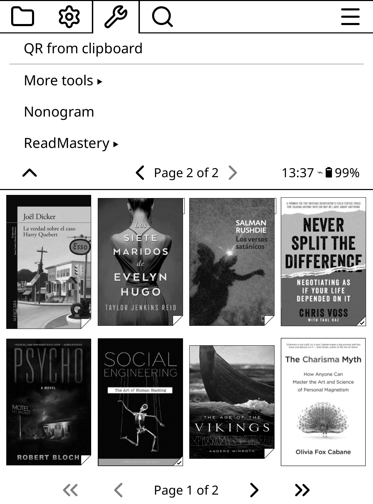

# 📚 ReadMastery - Gamify Your Reading

**ReadMastery** is a KOReader plugin that transforms your reading experience into an RPG-style adventure. Earn XP, level up, maintain streaks, and unlock achievements as you read!


---

## ✨ Features

### 🎮 Core Mechanics

| Feature | Description |
|---------|-------------|
| **XP System** | Earn XP for every page turned and every minute spent reading |
| **Leveling** | Level up as you gain XP (Levels 1-20+) |
| **Daily Streaks** | Build consecutive reading days |
| **Freeze Tokens** | Earn tokens every 7 days to protect your streak |

### 🏆 11 Achievements

Unlock badges as you reach milestones:

| Badge | Name | Requirement |
|-------|------|-------------|
| ☀️ | **Early Bird** | Read between 4:00 AM - 7:00 AM |
| 🌙 | **Night Owl** | Read between 12:00 AM - 4:00 AM |
| ⚔️ | **Weekend Warrior** | Read 100+ pages on Saturday or Sunday |
| 💯 | **The Centurion** | Read 100 pages in a single session |
| 🏃 | **Marathon** | Read for 3 hours continuously |
| ⚡ | **Sprint** | Read 50 pages in under 30 minutes |
| 🗺️ | **Format Explorer** | Read 3 different file formats |
| 📖 | **Book Slayer** | Finish a book (95% completion) |
| 🦸 | **Paperback Hero** | Read 1,000 lifetime pages |
| 📚 | **Bibliophile** | Read 5,000 lifetime pages |
| 👑 | **Literary Legend** | Read 10,000 lifetime pages |

### 📊 Progressive Feature Unlocks

Analytics features unlock as you level up:

| Level | Unlock |
|-------|--------|
| 1-2 | Basic stats (Level, XP, Streak) |
| 3 | **Session Stats** - Current session duration & pages |
| 5 | **7-Day Heatmap** - Visual reading intensity chart |
| 7 | **Weekly Digest** - Weekly summary with rank |
| 10 | **Speed Analytics** - Reading speed & style analysis |
| 15 | **Completion Rate** - Books started vs. finished |
| 20 | **Hall of Fame** - All-time records & achievements |

---

## 📥 Installation

### Method 1: Direct Download

1. Download the `ReadMastery.koplugin` folder
2. Copy it to your KOReader plugins directory:
   - **Kindle**: `/koreader/plugins/`
   - **Kobo**: `/.adds/koreader/plugins/`
   - **Android**: `/sdcard/koreader/plugins/`
   - **Desktop**: `~/.config/koreader/plugins/`
3. Restart KOReader

### Method 2: Git Clone

```bash
cd /path/to/koreader/plugins/
git clone https://github.com/YOUR_USERNAME/ReadMastery.koplugin.git
```

---

## 📁 Plugin Structure

```
ReadMastery.koplugin/
├── _meta.lua              # Plugin metadata
├── main.lua               # Entry point & event handlers
├── readmasterycore.lua    # Data management & persistence
├── xpengine.lua           # XP calculations
├── streakmanager.lua      # Streak & freeze token logic
├── achievements.lua       # Achievement definitions & checks
├── analytics.lua          # Statistics calculations
├── featureunlocks.lua     # Level-based feature unlocking
├── icons.lua              # ASCII icon definitions
├── ascii_art.lua          # Achievement ASCII art
└── ui/
    ├── mainmenu.lua       # Main menu interface
    ├── statsview.lua      # Quick stats display
    ├── achievements_view.lua  # Achievements list
    ├── ascii_popup.lua    # ASCII art popup widget
    └── notifications.lua  # Level up & achievement popups
```

---

## 🎯 Usage

### Accessing the Plugin

1. Open KOReader
2. Go to **Menu** → **Tools** → **ReadMastery**

### Menu Options

| Option | Description |
|--------|-------------|
| **View Stats** | See your current level, XP, streak, and progress |
| **Achievements** | Browse all 11 achievements (tap to see details) |
| **Streak Info** | Detailed streak and freeze token information |
| **Analytics** | Access unlocked analytics features |
| **Settings** | Sandbox mode, debug mode, reset progress |

### Settings

| Setting | Description |
|---------|-------------|
| **Sandbox Mode** | Temporarily unlocks all features for testing |
| **Reset Progress** | Permanently deletes all data (use with caution!) |

---

## 📈 XP System

### Earning XP

| Action | XP Earned |
|--------|-----------|
| Per page turned | 5 XP |
| Per minute reading | 2 XP |
| Achievement bonus | 50-1000 XP |

### Streak Multiplier

Consecutive reading days boost your XP:

| Streak | Multiplier |
|--------|------------|
| 0 days | 1.0x |
| 5 days | 1.25x |
| 10 days | 1.5x |
| 20 days | 2.0x (max) |

### Level Progression

XP required increases with each level:

| Level | Total XP Required |
|-------|-------------------|
| 2 | 100 XP |
| 3 | 250 XP |
| 5 | 625 XP |
| 10 | 2,375 XP |
| 20 | 9,500 XP |

---

## 🔥 Streak System

| Feature | Description |
|---------|-------------|
| **Building Streaks** | Read any amount each day to maintain your streak |
| **Freeze Tokens** | Earned every 7 consecutive days |
| **Token Usage** | Automatically consumed if you miss a day |
| **Streak Reset** | Missing a day without a token resets streak to 0 |

---

## 🛠️ Development

### Requirements

| Requirement | Version |
|-------------|---------|
| KOReader | Any recent version |
| Lua | 5.1 / LuaJIT |

### Data Storage

User data is stored in JSON format:

```
/koreader/data/readmastery/readmastery_data.json
```

### Adding Custom ASCII Art

Edit `ascii_art.lua` to customize achievement artwork:

```lua
AsciiArt.large = {
    your_achievement = [[

        Your ASCII art here
        Keep it under 48 characters wide
        for best display on e-readers

    ]],
}
```

### ASCII Art Tips

| Do | Don't |
|----|-------|
| Use spaces for background | Use dots (.) - they're too narrow |
| Keep width under 48 chars | Make overly complex designs |
| Use # @ % for filled areas | Use unicode characters |
| Test on actual device | Assume it will look the same |

---

## 🤝 Contributing

Contributions are welcome! Here's how:

1. Fork the repository
2. Create a feature branch
   ```bash
   git checkout -b feature/amazing-feature
   ```
3. Commit your changes
   ```bash
   git commit -m 'Add amazing feature'
   ```
4. Push to the branch
   ```bash
   git push origin feature/amazing-feature
   ```
5. Open a Pull Request

### Ideas for Contributions

- [ ] Daily/weekly reading goals
- [ ] Reading challenges
- [ ] Export stats to file
- [ ] Multiple user profiles
- [ ] Custom achievement creation
- [ ] Integration with reading lists
- [ ] Localization / translations
- [ ] Sound effects (for supported devices)

---

## 📝 License

This project is licensed under the MIT License.

```
MIT License

Copyright (c) 2024 YOUR_NAME

Permission is hereby granted, free of charge, to any person obtaining a copy
of this software and associated documentation files (the "Software"), to deal
in the Software without restriction, including without limitation the rights
to use, copy, modify, merge, publish, distribute, sublicense, and/or sell
copies of the Software, and to permit persons to whom the Software is
furnished to do so, subject to the following conditions:

The above copyright notice and this permission notice shall be included in all
copies or substantial portions of the Software.

THE SOFTWARE IS PROVIDED "AS IS", WITHOUT WARRANTY OF ANY KIND, EXPRESS OR
IMPLIED, INCLUDING BUT NOT LIMITED TO THE WARRANTIES OF MERCHANTABILITY,
FITNESS FOR A PARTICULAR PURPOSE AND NONINFRINGEMENT. IN NO EVENT SHALL THE
AUTHORS OR COPYRIGHT HOLDERS BE LIABLE FOR ANY CLAIM, DAMAGES OR OTHER
LIABILITY, WHETHER IN AN ACTION OF CONTRACT, TORT OR OTHERWISE, ARISING FROM,
OUT OF OR IN CONNECTION WITH THE SOFTWARE OR THE USE OR OTHER DEALINGS IN THE
SOFTWARE.
```

---

## 🙏 Acknowledgments

| | |
|---|---|
| [KOReader](https://github.com/koreader/koreader) | The amazing open-source ebook reader |
| KOReader Community | Documentation and plugin examples |
| Contributors | Everyone who helps improve this plugin |

---

## 📬 Contact

| Channel | Link |
|---------|------|
| **Issues** | [GitHub Issues](https://github.com/Lalocaballero/ReadMastery.koplugin/issues) |
| **Discussions** | [GitHub Discussions](https://github.com/Lalocaballero/ReadMastery.koplugin/discussions) |

---
## 📸 Screenshots

### Plugin Location & Main Menu

| Tools Menu | ReadMastery Menu |
|:----------:|:----------------:|
|  |  |
| *Find ReadMastery under Tools* | *Main plugin menu* |

### Stats & Achievements

| Stats View | Achievements |
|:----------:|:------------:|
|  |  |
| *Level, XP, Streak info* | *11 unlockable badges* |

### Analytics Features

| Analytics Menu | 7-Day Heatmap |
|:--------------:|:-------------:|
|  |  |
| *Unlocks as you level up* | *Visual reading intensity* |

### Settings & Info

| Settings | About |
|:--------:|:-----:|
|  |  |
| *Sandbox, Reset* | *Plugin information* |
---

<p align="center">
  <b>Happy Reading! 📚✨</b>
  <br><br>
  <i>Every page counts towards your next level!</i>
  <br><br>
  ⭐ Star this repo if you find it useful! ⭐
  <br><br>
  <a href="https://www.buymeacoffee.com/lalocaballero">
    
  </a>
</p>